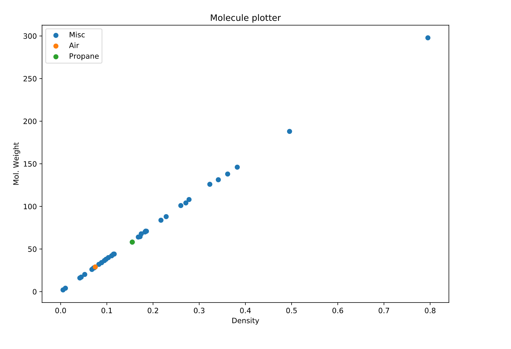

# Mass / Density Plot


```python

print s
```
### ABOUT:
This is a quick project to analyse the relation between the weight of molecules and their density.
This is analysed through a plotted graph executed in Jupyter

### FEATURES:
- Python 3
- Jupyter
- Pandas Dataframes
- Graph/pyplot from matplotlib
- Get Moleculair Mass of any molecule
- Compare the density of any molecule

### USES:
- Compare any gasious molecule with air to know if it floats or sinks
- Visually see the linear correlation between density and mass
- Find the moleculair mass of any molecule by providing its Symbol (ex. 'CO2')

### PURPOSE:
- It's original purpose was to find out if stove gasses floated
- Find out if Carbon Monoxide (CO) floats or sinks (spoiler alert: neither floats or sinks)
